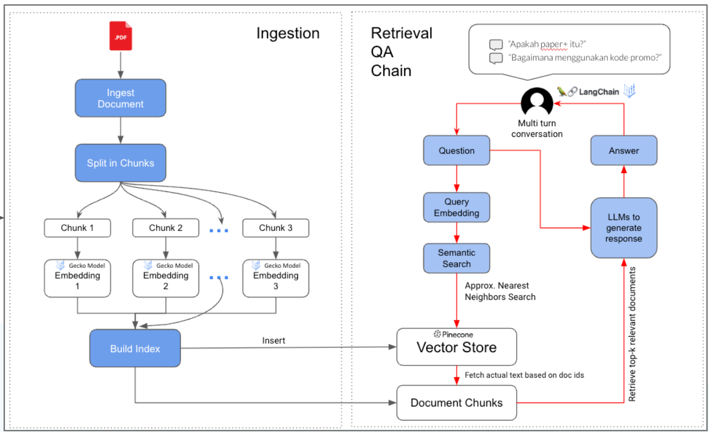
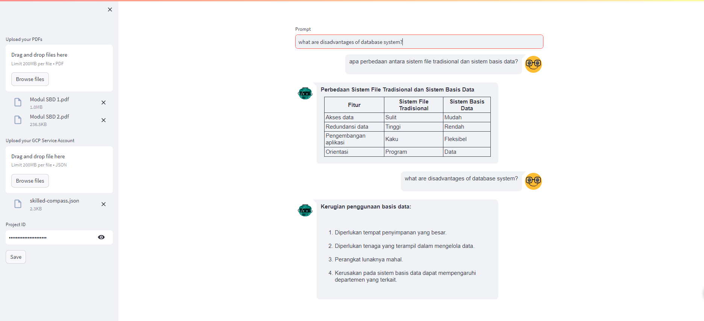

## Multiple PDFs Chatbot using Streamlit, Langchain, FAISS, and Vertex AI



### Project Overview
This repository contains a multiple PDFs chatbot built using Streamlit, Python, Langchain, FAISS, and Vertex AI. The chatbot allows users to upload PDF files, specify a service account (JSON), and provide the Google Cloud Platform (GCP) project ID to interact with the chatbot and extract information from the uploaded PDFs.

### Tech Stack
* [**Streamlit**](https://streamlit.io/): A web app framework for Python.
* [**FAISS**](https://faiss.ai/index.html): a library for efficient similarity search and clustering of dense vectors (Local vector store).
* [**Langchain**](https://python.langchain.com/docs/get_started/introduction): A library for natural language processing (NLP).
* [**Vertex AI**](https://cloud.google.com/vertex-ai?hl=en): A managed machine learning (ML) platform on Google Cloud. It is an alternative for OpenAI.


### Features
1. Upload multiple PDF files.
2. Specify a GCP service account (JSON) for authentication.
3. Provide the GCP project ID for accessing Vertex AI services.
4. Extract information from the uploaded PDFs using Langchain by entering the question.
5. Able to memorize the previous question



### Installation
Follow the steps below to set up and run the PDF chatbot:

#### 1. Clone the Repository

```bash
git clone https://github.com/ridwanspace/multiple-pdf-chatbot.git
cd multiple-pdf-chatbot
```

#### 2. Install Dependencies
```bash
pip install -r requirements.txt
```

#### 3. Run the Chatbot
```bash
streamlit run app.py
```
Visit the provided URL in your browser to interact with the PDF chatbot.

### How to use (Example)
You can watch this [video](https://youtu.be/GetmaKCNtq0) on how to use this app.

### Cost
Check this [pricing](https://cloud.google.com/vertex-ai/pricing#generative_ai_models) in Google Cloud

